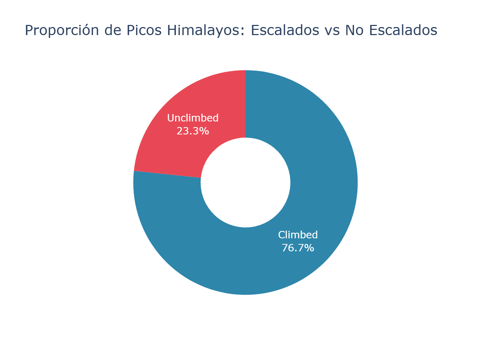
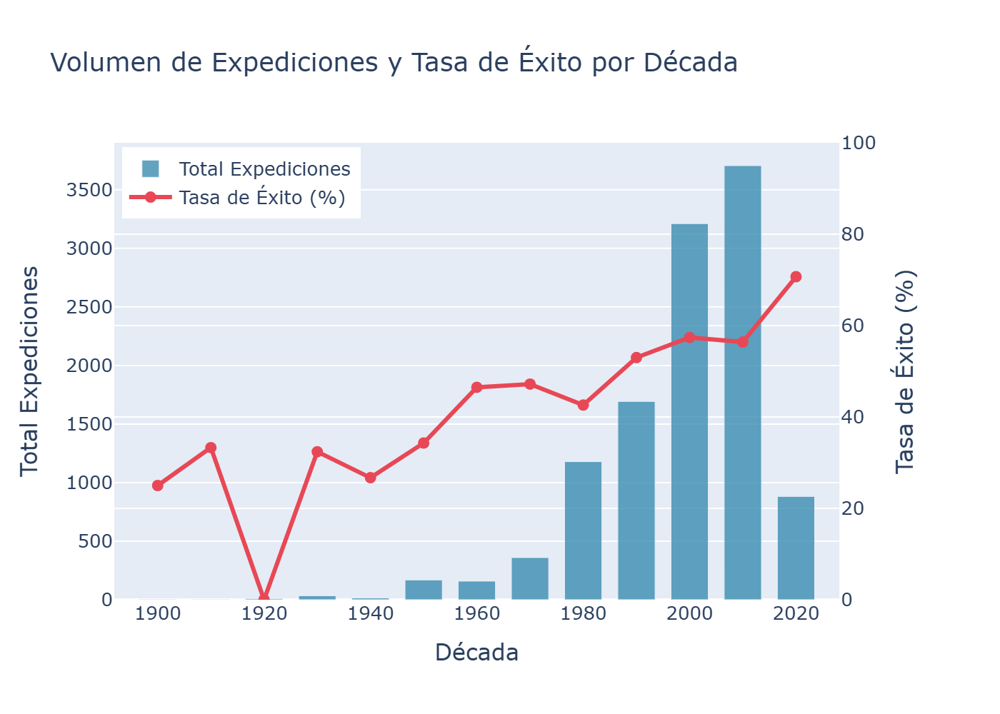
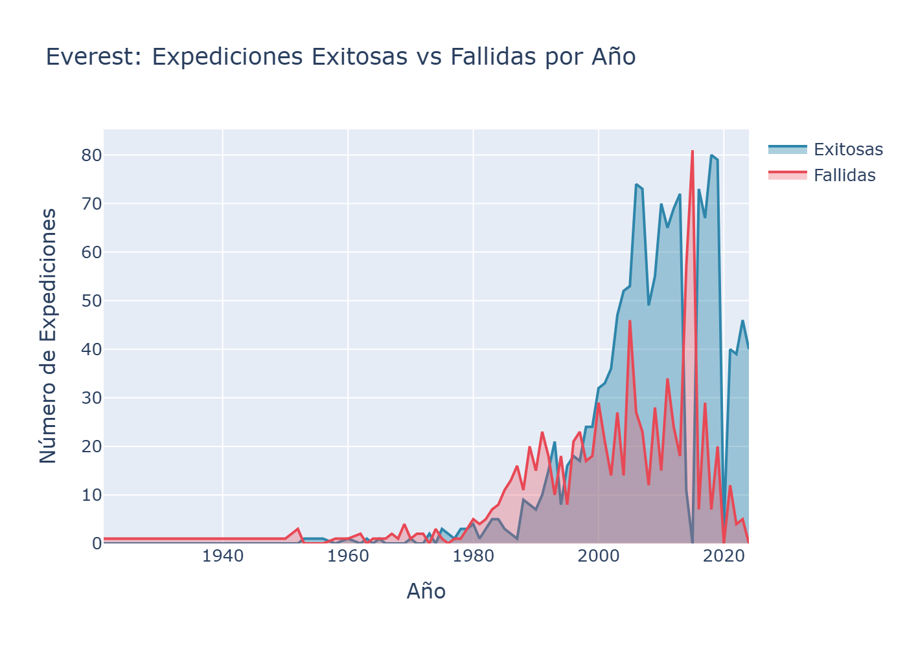
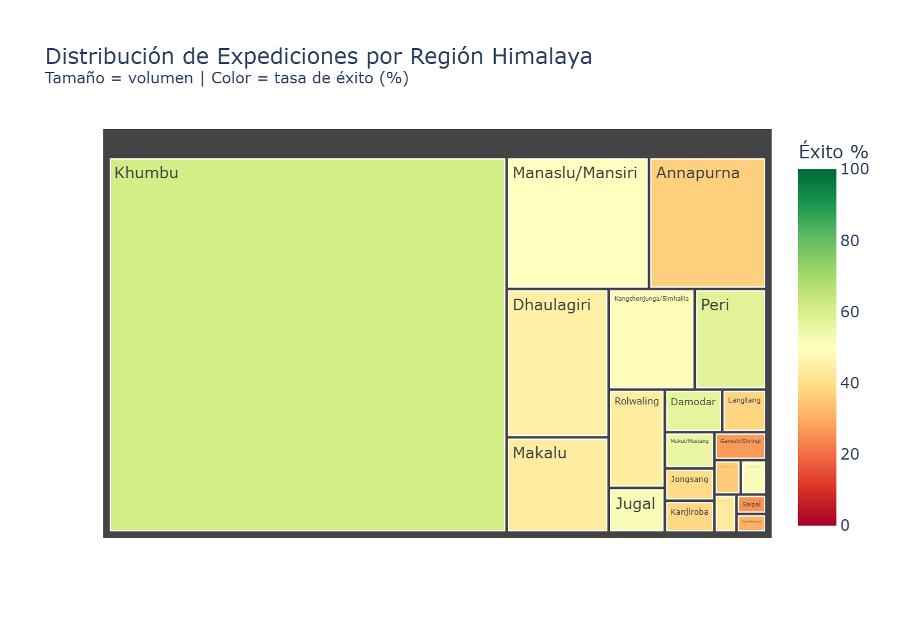

# Himalayan Climbing Expeditions (1905–2024)
### Portfolio Data Analysis Project

A full end-to-end data analysis of 120 years of mountaineering history in the Himalayas — from raw CSV data to professional interactive visualizations.

---

## Project Overview

This project analyzes the **Himalayan Expeditions Database**, one of the most comprehensive records of high-altitude mountaineering ever compiled. It covers:

- **11,562 expeditions** across **481 Himalayan peaks**
- **89,391 individual climbers** from over 100 countries
- Data spanning **1905 to 2024**, including the golden age of first ascents and the modern commercial era

The analysis answers four research questions about conquest metrics, elite climbers, temporal trends, and a deep-dive into Mount Everest.

---

## Key Insights

- **The Himalayas remain largely unconquered:** Only a fraction of the 481 registered peaks have been successfully summited at least once, revealing enormous potential for exploration.
- **Sherpa dominance in elite rankings:** The top summiteers are overwhelmingly Nepali Sherpas, whose physiological adaptation and accumulated experience set them apart from any other nationality.
- **Commercial era transformed success rates:** From the 1990s onward, both the volume of expeditions and success rates increased dramatically — a direct consequence of guided commercial routes.
- **Supplemental oxygen doubles Everest summit chances:** Expeditions using bottled oxygen on Everest show significantly higher success rates than those attempting the climb alpine-style without it.
- **Regional concentration:** The Khumbu Himal (Everest region) absorbs the majority of expedition volume; remote western ranges maintain much lower success rates due to logistical difficulty.

---

## Methodology

```
data/raw/          →   src/data_utils.py   →   notebooks/himalayan_analysis.ipynb
(5 raw CSVs)           (clean & merge)          (EDA + visualizations)
                                            ↓
                                       data/processed/    output/figures/
                                       (clean CSVs)       (PNG exports)
```

1. **Load:** `src/data_utils.py` reads the 4 main tables and returns cleaned DataFrames.
2. **Clean:** Impute boolean nulls as `False`, normalize text fields, standardize join keys.
3. **Merge:** Join `exped` ↔ `peaks` via `peakid` to create a master analytical table.
4. **Analyze & Visualize:** Each section in the notebook answers one research question with a Plotly chart.

---

## Visual Highlights

| Conquest Metrics | Temporal Trends |
|:---:|:---:|
|  |  |

| Everest Deep-Dive | Regional Treemap |
|:---:|:---:|
|  |  |

---

## Tech Stack

| Tool | Purpose |
|------|---------|
| Python 3.x | Core language |
| Pandas | Data loading, cleaning, aggregation |
| Plotly | Interactive visualizations & PNG export |
| Jupyter | Reproducible analysis notebook |

---

## How to Run

```bash
# 1. Install dependencies
pip install -r requirements.txt

# 2. Launch Jupyter
jupyter notebook notebooks/himalayan_analysis.ipynb

# 3. Run all cells: Kernel → Restart & Run All
```

---

## Dataset Source

The Himalayan Database is maintained by the **Himalayan Database** organization and compiled from Elizabeth Hawley's meticulous records spanning decades of field research in Nepal.
